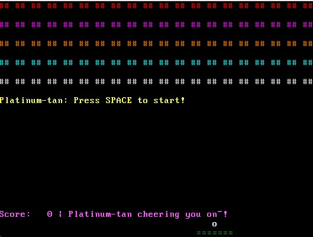

# 💿✨ Platinum OS: VGA Arkanoid Retro Game 🧱🎾
]

> A colourful, low-level VGA Arkanoid built from scratch in pure Rust `#![no_std]`, without `alloc`, running in text mode.  
> Cuteness powered by **Platinum-tan**. 💖

---

## 🌈 Features

- 🎮 **Playable Arkanoid Clone** in 80x25 VGA Text Mode
- 🧱 **Blocks in Rainbow Colours** — each row has its own style!
- 🎾 **Ball Physics** — bounces off walls, blocks, and your paddle
- 💚 **Green Paddle** — move with `A` and `D`
- 🧠 **Written in Safe, Modern Rust**, with:
    - `#![no_std]`
    - No heap or allocation
    - Pure VGA memory writes
- 🔁 **Restart with `R`**, Start with `SPACE`
- 🌸 **Platinum-tan Messages** on screen to cheer you on 💬

---

]


## 🖥️ Controls

| Key   | Action              |
|-------|---------------------|
| `A`   | Move paddle left    |
| `D`   | Move paddle right   |
| `SPACE` | Start ball        |
| `R`   | Restart the game    |

---

## 🧪 How to Run

1. 🔧 Make sure you have `rustup`, nightly toolchain, and `bootimage`:

   ```sh
   rustup install nightly
   rustup component add rust-src --toolchain nightly
   cargo install bootimage
   ```

2. 

    ```sh
     cargo +nightly bootimage -Z build-std=core,compiler_builtins --target x86_64-platinum_os.json -Z build-std-features=compiler-builtins-mem --target-dir target/x86_64-platinum_os
    ```

3. 
    ```sh
    qemu-system-x86_64 -drive format=raw,file=target\x86_64-platinum_os\x86_64-platinum_os\debug\bootimage-platinum_os.bin -serial stdio -no-reboot -no-shutdown
    ```